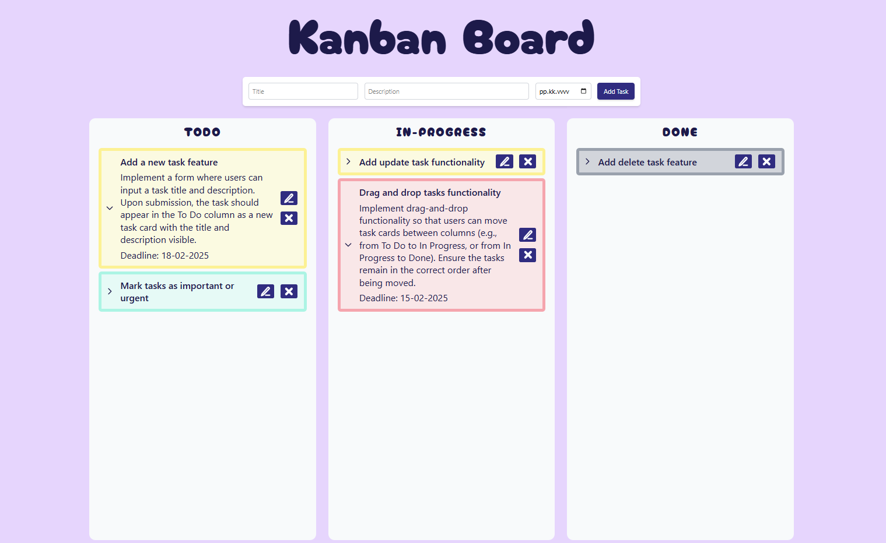

# My React Kanban Board

This project is a simple Kanban board application built with React. It allows users to manage tasks by adding, updating and deleting them. Tasks can be moved between different columns representing different statuses.

You can try the kanban board [here](https://niisku.lab.fi/~x115562/Kanban/index.html).



## Features

- Currently only available for web devices.
- Add new tasks with a title, description, and deadline.
- Update the status of tasks by dragging and dropping them between columns.
- Update task title, description and deadline and save changes
- Delete tasks.
- Tasks are saved in the browser's local storage.
- Expand/collapse task view by pressing task.
- Priority levels are indicated by color:
  - 🔴 High Priority – Urgent tasks that need immediate attention
  - 🟡 Medium Priority – Important but not critical tasks
  - 🟢 Low Priority – Non-urgent tasks with no immediate deadline
  - ⚪ Completed – Tasks that have been finished

## Upcoming Features

- Responsiveness for different screen sizes and devices.

## Project Structure

The project is structured as follows:

- `src/components`: Contains the React components used in the application.
  - `App.tsx`: The main application component.
  - `Board.tsx`: The Kanban board component that contains columns and the task form.
  - `Column.tsx`: The column component that holds tasks.
  - `Task.tsx`: The task component that represents individual tasks.
  - `TaskForm.tsx`: The form component for adding new tasks.
- `src/types.ts`: Defines TypeScript types/interfaces used in the application.
- `src/useTaskManager.ts`: Custom hook for managing tasks and their statuses.

## Getting Started

### Prerequisites

- Node.js and npm installed on your machine.

### Installation

1. Clone the repository:
   ```sh
   git clone https://github.com/ElliAur/react-kanban-board.git
   ```
2. Navigate to the project directory:
   ```sh
   cd react-kanban-board
   ```
3. Install the dependencies:
   ```sh
   npm install
   ```

### Running the Application

To start the development server, run:
```sh
npm run dev
```
This will start the application and open it in your default web browser.

## License

This project is licensed under the MIT License. See the [LICENSE](../LICENSE) file for details.

## Author

This project was developed by [ElliAur](https://github.com/ElliAur) as a learning exercise to explore React in February 2025.
